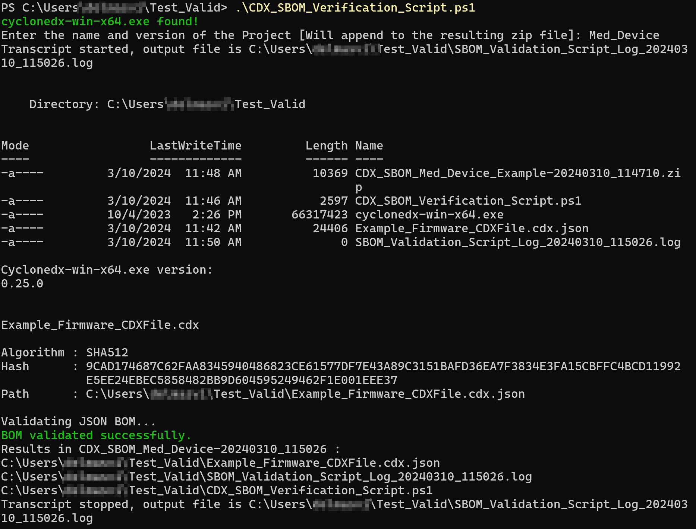

# CycloneDX_format_Validator
Powershell script validating any CycloneDX formatted SBOM with the .cdx.json extension in the folder where the script is executed.
The script then add the validated SBOM files and the logging of the validation (transcript) into a zip file for archive.
In the folder Example is an example of a cycloneDX version 1.4 validated SBOM (Example\Example_Firmware_CDXFile.cdx.json) as well as the output from this script.

this script is based on the CyclonDX cli tool: https://github.com/CycloneDX/cyclonedx-cli
